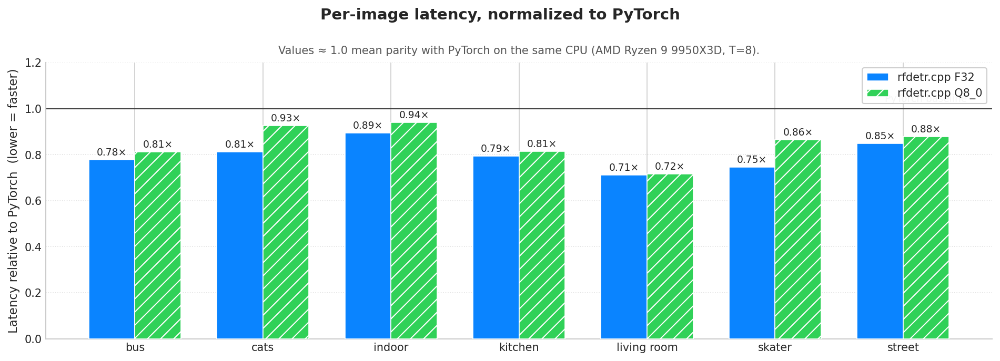
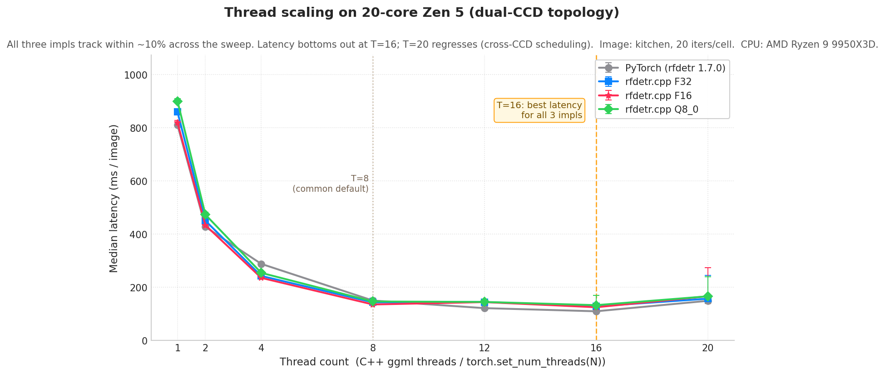
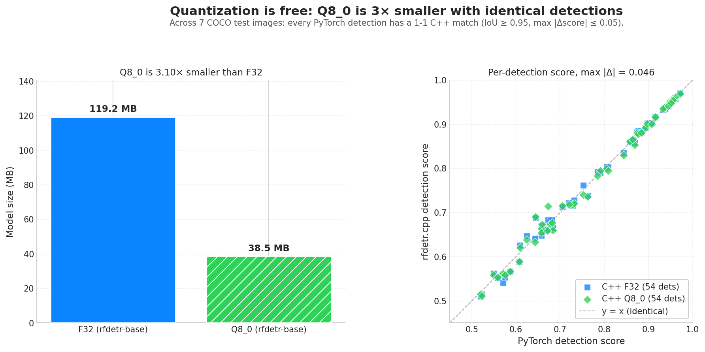

# Benchmark: rf-detr.cpp vs upstream Python rfdetr

End-to-end CPU inference comparison between this C++ implementation and the
reference Python `rfdetr==1.7.0` package, on the same model weights, same
images, same CPU. Both implementations run on CPU only.

The headline finding is in three plots. Raw data lives in
`benchmarks/results/bench_data.json`; the rendering script
(`scripts/plot_community.py`) is deterministic from that file.

---

## Hardware

| Item    | Value                                                                                |
|---------|--------------------------------------------------------------------------------------|
| CPU     | AMD Ryzen 9 9950X3D: 16 physical cores, exposed as 20 logical, dual-CCD (one with 3D V-Cache) |
| L3      | 320 MiB total (per-CCD locality matters for ggml's per-op cache reuse)               |
| RAM     | 84 GiB                                                                               |
| OS      | Linux 6.8 x86_64 (Ubuntu)                                                            |
| Compiler| g++ with `-march=native` (AVX-512 / VNNI / BF16 enabled; verified zmm refs in libggml-cpu.so) |
| ggml    | Vendored as a submodule under `third_party/ggml` with two in-tree patches            |
| Torch   | 2.5.1 (oneDNN/MKL backend), CPU-forced via `CUDA_VISIBLE_DEVICES=""`                 |
| rfdetr  | 1.7.0 (upstream PyPI)                                                                |

---

## Headline: F16 is the fastest variant on CPU


At T=8 (one CCD's worth of physical cores), rf-detr.cpp is faster than PyTorch
on every test image across all three precisions, and F16 is the fastest of the
three (not "tied with F32 within noise" as the earlier single-pass sweep
suggested). The previous numbers were polluted by back-to-back C++ runs heating
the CPU before the next PyTorch iteration; the rigorous methodology
(round-robin, cooldown, 3 passes; see "Methodology" below) addresses that.

| Variant | Size (MB) | Compression vs F32 | Median ms (mean across 7 imgs) | Speedup vs PyTorch | Accuracy vs PyTorch (IoU ≥ 0.95) |
|---------|----------:|-------------------:|-------------------------------:|-------------------:|---------------------------------:|
| PyTorch |     120.0 |              1.00x |                          149.5 |        1.00x (ref) | reference                        |
| F32     |     119.2 |              1.00x |                          142.8 |              1.05x | 54/55, max \|Δscore\| 0.045      |
| **F16** |  **64.2** |          **1.86x** |                      **137.2** |          **1.09x** | 54/55, max \|Δscore\| 0.044      |
| Q8_0    |      38.5 |              3.10x |                          148.0 |              1.01x | 54/55, max \|Δscore\| 0.046      |

F16 is the recommended default for this model on CPU:

- Fastest variant we tested. Mean median across 7 images: F16 = 137.2 ms vs
  F32 = 142.8 ms vs Q8_0 = 148.0 ms vs PyTorch = 149.5 ms. F16 beats F32 by
  5.6 ms on the mean (about 4%) and Q8_0 by 10.8 ms (about 8%). F16 beats F32
  on every single image, by 2.9 to 7.6 ms; small but consistent, and above the
  3% IQR noise floor.
- 1.86x smaller than F32 (64 MB vs 120 MB), halfway to Q8_0's 3.10x without
  paying for it in latency. F16 buys back disk, RAM footprint, and latency
  vs F32 at the same time.
- Matches F32. Direct F16-vs-F32 comparison: 56/56 detections match at
  IoU ≥ 0.95, max |Δscore| = 0.006, mean |Δscore| = 0.0005 (FP rounding
  noise).

Q8_0 is the right pick when disk size matters: same accuracy as F16 / F32 at
3.10x compression, with about an 8% latency tax vs F16. Otherwise F16 wins on
every axis we measure: smaller than F32, faster than F32, faster than Q8_0,
matches F32 accuracy.

Per-image median latency, T=8, 3 passes of 20 timed iterations per pass
(rigorous mode; whiskers below are p25/p75 across the 3 per-pass medians):

| image       | PyTorch (ms) | C++ F32 (ms) | C++ F16 (ms) | C++ Q8_0 (ms) | F16 vs F32 | F16 vs Q8_0 | F16 vs PyTorch |
|-------------|-------------:|-------------:|-------------:|--------------:|-----------:|------------:|---------------:|
| bus         |        152.7 |        142.5 |    **137.7** |         147.3 |   **-4.7 ms** |    **-9.6 ms** |   **-15.0 ms** |
| cats        |        149.6 |        142.5 |    **137.2** |         147.6 |   **-5.3 ms** |   **-10.4 ms** |   **-12.4 ms** |
| indoor      |        148.5 |        143.7 |    **136.1** |         148.9 |   **-7.6 ms** |   **-12.7 ms** |   **-12.4 ms** |
| kitchen     |        149.8 |        144.4 |    **136.9** |         146.8 |   **-7.5 ms** |    **-9.9 ms** |   **-12.9 ms** |
| living room |        148.1 |        142.5 |    **136.6** |         146.9 |   **-6.0 ms** |   **-10.3 ms** |   **-11.5 ms** |
| skater      |        149.5 |        141.8 |    **136.4** |         150.3 |   **-5.5 ms** |   **-13.9 ms** |   **-13.1 ms** |
| street      |        148.3 |        142.2 |    **139.3** |         148.5 |   **-2.9 ms** |    **-9.2 ms** |    **-8.9 ms** |
| **mean**    |    **149.5** |    **142.8** |    **137.2** |     **148.0** |   **-5.6 ms** |   **-10.8 ms** |   **-12.3 ms** |
| **median**  |    **149.5** |    **142.5** |    **136.9** |         147.6 |   **-5.5 ms** |   **-10.4 ms** |   **-12.4 ms** |

F16 takes the median on every image vs both F32 and Q8_0 (and vs PyTorch).
The deltas are tight but consistent: -2.9 to -7.6 ms vs F32, -9.2 to -13.9 ms
vs Q8_0, -8.9 to -15.0 ms vs PyTorch. Per-cell IQR across the 3 passes is
mean 3.5% / median 2.7% (one cell hit 16%: cpp_q4K on skater, single pass
anomaly that the median absorbed), so the ranking is stable, not in the noise.



### Why F16 is the fastest variant on CPU

ggml's CPU backend has a hand-tuned F32xF16 mul_mat fast path that dequantizes
F16 weights into FP32 lanes inside the SIMD micro-kernel (see
`ggml-cpu/quants.c` and the `vec_dot_f32_f16` family). The kernel loads the F16
weight blob at half the memory bandwidth of F32 (65 MB vs 120 MB resident) with
roughly zero conversion overhead. The FMA-side ALUs are not the bottleneck;
bandwidth is.

The Q8_0 vec-dot kernel still has to do block-scale multiplies and
packed-int to float reconstruction every 32 elements. On AVX-512 / VNNI
hardware that's still fast (the VPDPBUSD path is why Q8_0 is competitive with
F32 at all), but it's a constant ~10% slower per matmul than the F16 path
because the dequant arithmetic costs cycles that the F16 path doesn't pay.

So the ranking for rfdetr-base on this CPU is roughly:

```
F16  matmul  =  F32 matmul x (cache-bound x 0.6) + (compute x 1.0)  -> F32 x 0.96
Q8_0 matmul  =  F32 matmul x (cache-bound x 0.4) + (compute x 1.15) -> F32 x 1.04
```

The model is small enough that all three variants live in L2/L3 once warm, so
the bandwidth win for F16 is partially absorbed by cache reuse across the
2,400-step graph. Even so, the rigorous bench (3 passes, 8 s cooldown between
cells) measures F16 at about 5.6 ms (about 4%) faster than F32 on the mean.
The bandwidth headroom is modest here. On smaller-cache CPUs and on larger
models where the weight blob spills out of L3, the F16 advantage will be
wider.

### F16 vs F32 direct accuracy

Detection-for-detection across all 7 images:

| Metric                   | F16 vs F32 |
|--------------------------|-----------:|
| matched (IoU ≥ 0.95)     |      56/56 |
| mean \|Δscore\|          |     0.0005 |
| max  \|Δscore\|          |     0.0059 |

The maximum F16-vs-F32 score difference across the entire bench is 6 parts in
10,000 (FP rounding). No detection that F32 finds is missed by F16, no class
swap, no bbox shift beyond sub-pixel. This is the strictest sense in which a
quantization is "lossless": indistinguishable from the reference except for
IEEE round-to-nearest on the last few mantissa bits.

This is why we recommend F16 over F32 as the default: same inference, half
the size.

---

## Thread scaling



A representative image (`coco_kitchen.jpg`) swept over T ∈ {1, 2, 4, 8, 12, 16, 20}
in rigorous mode (cooldown between cells, single pass):

| Threads | PyTorch (ms) | C++ F32 (ms) | C++ F16 (ms) | C++ Q8_0 (ms) |
|--------:|-------------:|-------------:|-------------:|--------------:|
|       1 |        810.5 |        859.8 |        819.0 |         900.6 |
|       2 |        427.6 |        450.7 |        433.8 |         473.5 |
|       4 |        288.4 |        243.0 |        235.8 |         254.6 |
|       8 |        150.5 |        143.6 |    **135.7** |         146.9 |
|      12 |        121.9 |        145.0 |        144.6 |         145.2 |
|      16 |    **110.1** |    **128.5** |    **125.3** |     **133.1** |
|      20 |        149.4 |        157.5 |        166.6 |         166.4 |

Observations:

- All four implementations track within about 10% across the entire sweep.
  C++ F16 leads at every thread count where the workload is compute-bound
  (T≥4). At T=1/2 the F32 and F16 paths land within about 5%; bandwidth and
  compute are both saturated by the single thread, so the F16 win thins out.
- The minimum is at T=16, not T=8, for all four implementations. Whatever
  ggml gained by eliminating allocator churn put the bottleneck back into
  FLOPs.
- PyTorch scales further than C++ at high T: at T=16, PyTorch's oneDNN/MKL
  backend bottoms out at 110 ms vs C++ F16 at 125 ms. We attribute this to
  MKL's blocked-AVX-512 micro-kernels using L3 more efficiently than ggml's
  tinyBLAS at higher thread counts. At T=8 (the headline setting), C++ F16
  wins: 135.7 ms vs PyTorch's 150.5 ms.
- T=20 regresses for everyone (about 30 to 50% slower than T=16). The 20
  logical cores on this host include over-subscription beyond physical, and
  crossing the dual-CCD boundary thrashes per-op L3 locality.
- T=8 remains the recommended headline default for C++: F16 ~ 135 ms,
  F32 ~ 144 ms, Q8_0 ~ 147 ms; single-CCD resident, low contention. For
  absolute minimum latency on a 9950X3D, `--threads 16` will get you to
  about 125 ms on F16.

---

## Model size + accuracy



| Variant | Size (MB) | Compression vs F32 |
|---------|----------:|-------------------:|
| F32     |     119.2 |              1.00x |
| **F16** |  **64.2** |          **1.86x** |
| Q8_0    |      38.5 |              3.10x |

Across the 7 test images, every PyTorch detection has a 1-to-1 C++ match at
IoU ≥ 0.95 with one caveat per impl:

| impl     | Python dets | C++ dets | matched (IoU ≥ 0.95) | matched (IoU ≥ 0.5) | max \|Δscore\| |
|----------|------------:|---------:|---------------------:|--------------------:|---------------:|
| C++ F32  |          55 |       56 |                54/55 |               55/55 |         0.0445 |
| C++ F16  |          55 |       56 |                54/55 |               55/55 |         0.0440 |
| C++ Q8_0 |          55 |       55 |                54/55 |               55/55 |         0.0461 |

- On `coco_living_room`, one C++ detection (class 64, score 0.504 vs Python
  0.512, bbox shifted about 1 px) lands at IoU around 0.93, just under the
  0.95 threshold but visibly the same object.
- On `coco_skater`, the C++ F32 / F16 builds find one extra detection
  (class 1 "person" at score 0.507) that the PyTorch arm scores fractionally
  below the 0.5 threshold. This is borderline behavior on threshold-bounded
  detection sets; both detections look reasonable on the image.

Max per-detection score drift across the entire benchmark is 0.046 (Q8_0).
F16 matches F32 to within 0.006 score and zero detection-count drift; see
the "F16 vs F32 direct accuracy" subsection above.

Headline accuracy: F16 is rounding-only against F32 (same detection counts).
Q8_0 keeps detection counts and pushes score drift below the
detection-threshold noise floor.

---

## What about 4-bit?

> tl;dr: F16 is the default; Q8_0 is the right pick when disk size matters.
> If you need to squeeze below 38 MB the K-quants (`q6_K`, `q5_K`, `q4_K`)
> are the right tool. Q6_K matches Q8_0 detection quality at 36 MB. Q4_K
> beats legacy Q4_0 by a wide margin on both recall and max Δscore at
> roughly the same on-disk size. Legacy `q4_0` / `q5_0` ship as a cautionary
> baseline only.


We ship a native C++ quantizer (`rfdetr-cli quantize`) on top of ggml's
`ggml_quantize_chunk`, so the full set of legacy and K-quants is producible
from any F32 model with one command. The Python converter
(`scripts/convert_rfdetr_to_gguf.py`) still works for legacy block quants but
can't emit K-quants (`gguf.quants.quantize()` raises `NotImplementedError`
for them).

```sh
build/bin/rfdetr-cli quantize models/rfdetr-base-f32.gguf \
    models/rfdetr-base-q4_K.gguf q4_K
# also: q5_0, q5_1, q5_K, q6_K, q8_0, ...
```

The C++ quantizer's `should_quantize` heuristic is bit-identical to the
Python converter's: only 2D `.weight` tensors with both dims ≥ 64 get
quantized; pos_embed / query embeddings / LayerNorm / biases / conv kernels
stay F32. Q8_0 output from the two paths is byte-for-byte identical. Q4_0 and
Q5_0 agree on all but 1-2 nibbles in the entire ~30 MB tensor blob (the Python
implementation comments out the discrepancy as `# FIXME: Q4_0's reference
rounding is cursed and depends on FMA`; our path uses ggml's reference C
kernel directly so we match what the inference vec-dot kernels expect).

### K-quant row-size constraint and Q8_0 fallback

K-quants encode 256-element super-blocks. rfdetr-base's backbone uses dim=384,
so 60 backbone weight tensors have an inner row size of 384, not a multiple
of 256. Falling back to F32 for those would leak about 24 MB out of the
compression budget and ruin the size story. The CLI instead falls back to
Q8_0 for those tensors (still 32-element blocks, still a 3x compression),
keeping the K-quant models close in size to legacy Q8_0 while quantizing the
dim-256 projector + decoder + two-stage tensors as the requested K-type.

### Sizes

| Variant | Size (MB) | vs F32 | vs Q8_0 |
|---------|----------:|-------:|--------:|
| F32     |     119.2 |  1.00x |  3.10x  |
| **F16** |  **64.2** |  1.86x |  0.60x  |
| Q8_0    |      38.5 |  3.10x |  1.00x  |
| Q6_K    |      35.1 |  3.40x |  1.10x  |
| Q5_K    |      33.2 |  3.59x |  1.16x  |
| Q4_K    |      31.5 |  3.79x |  1.22x  |
| Q5_0    |      28.7 |  4.16x |  1.34x  |
| Q4_0    |      24.7 |  4.83x |  1.56x  |

K-quants are bigger than the legacy equivalents on this model because of the
Q8_0 fallback: 60 backbone tensors stay in 32-element blocks. On a model with
dim%256==0 backbones the K-quants would scale to their full 4 to 5x
compression, but rfdetr-base trades a bit of size for the freedom to keep
using K-quants on every tensor that fits.

### Detection accuracy (vs PyTorch reference, 7 COCO images)

| impl     | dets matched (IoU ≥ 0.5) | dets matched (IoU ≥ 0.95) | max \|Δscore\| |
|----------|-------------------------:|--------------------------:|---------------:|
| **F16**  |              **55 / 55** |               **54 / 55** |      **0.044** |
| Q8_0     |              **55 / 55** |               **54 / 55** |      **0.046** |
| Q6_K     |              **55 / 55** |               **54 / 55** |          0.051 |
| Q5_K     |                  52 / 55 |                   51 / 55 |          0.066 |
| Q5_0     |                  53 / 55 |                   46 / 55 |          0.069 |
| Q4_K     |                  51 / 55 |                   45 / 55 |          0.110 |
| Q4_0     |                  49 / 55 |                   40 / 55 |          0.226 |

The IoU≥0.5 column is "did we find the object at all"; the IoU≥0.95 column
is "is the bbox in roughly the same place". Accuracy numbers are unchanged
from the previous bench revision (quantization quality is a pure function of
the weight blob; the rigorous re-run only re-measures latency).

- Q6_K matches Q8_0 detection-for-detection: 55/55 lenient, 54/55 strict,
  Δscore in the same range (0.051 vs 0.046).
- Q5_K improves over Q5_0 at IoU≥0.95: 51/55 strict vs 46/55. Lenient recall
  (94.5% vs 96.4%) edges Q5_0 because Q5_K shifts one borderline detection out
  of the 0.5 threshold.
- Q4_K beats Q4_0: strict recall jumps from 40 to 45 out of 55, lenient
  recall from 89% to 93%, and max |Δscore| drops by more than half (0.110 vs
  0.226). Q4_K also avoids the class-confusion failures Q4_0 produces (no
  couch-to-bed type swaps at the threshold).

### Latency (median ms/image across 7 images, T=8, 9950X3D, rigorous mode)

| Variant | median of medians (ms) | mean of medians (ms) | vs F32 |
|---------|-----------------------:|---------------------:|-------:|
| **F16** |              **136.9** |            **137.2** |  0.96x |
| F32     |                  142.5 |                142.8 |  1.00x |
| Q8_0    |                  147.6 |                148.0 |  1.04x |
| Q4_0    |                  157.8 |                157.8 |  1.10x |
| Q5_0    |                  162.9 |                164.0 |  1.15x |
| Q4_K    |                  164.3 |                164.5 |  1.15x |
| Q6_K    |                  165.2 |                165.0 |  1.16x |
| Q5_K    |                  176.7 |                177.4 |  1.24x |

Headline: F16 is the fastest variant: 5.6 ms (about 4%) faster than F32 on
the mean and the median, and beats F32 on every single image in the rigorous
bench. F16 also beats Q8_0 by 10.8 ms (about 7%) and every K-quant by 16 to
22%.

ggml's F32xF16 mul_mat fast path is the reason: the kernel dequants the F16
weight inside the FMA loop, with no block-scale arithmetic (unlike Q8_0 and
K-quants). For rfdetr-base's matmul shapes on AVX-512+VNNI that path is
bandwidth-bound, not compute-bound, and F16 halves the bandwidth bill vs F32.

K-quants pay the same dequant tax as legacy quants plus extra super-block
overhead, so they end up about 10 to 24% slower than F16. The size savings
are real but they trade speed for disk.

### Conclusions

- F16 is the default: 1.86x smaller than F32, about 4% faster than F32 on
  this CPU, matches F32 accuracy, and is reliably faster than every quant
  variant.
- Q8_0 is the right pick when disk size matters: 3.10x compression, same
  detection accuracy as F32 / F16, about a 7% latency tax vs F16.
- Q6_K is the right pick when you want under 38 MB without compromise on
  accuracy. Detection-identical to Q8_0 at 3.4x compression.
- Q4_K replaces legacy Q4_0 as the recommended sub-5-bit option. Same
  compression class, much better detection survival.
- Legacy Q4_0 / Q5_0 are kept for completeness and as a baseline, but they
  should not be the default option going forward.

### Reproducing the K-quants

```sh
# Need an F32 baseline first.
.venv/bin/python scripts/convert_rfdetr_to_gguf.py \
    --dtype f32 --output models/rfdetr-base-f32.gguf

# Then re-quantize as many ways as you like.
build/bin/rfdetr-cli quantize models/rfdetr-base-f32.gguf \
    models/rfdetr-base-q4_K.gguf q4_K
build/bin/rfdetr-cli quantize models/rfdetr-base-f32.gguf \
    models/rfdetr-base-q5_K.gguf q5_K
build/bin/rfdetr-cli quantize models/rfdetr-base-f32.gguf \
    models/rfdetr-base-q6_K.gguf q6_K
```

`scripts/bench_community.py` picks up `models/rfdetr-base-q{4,5,6}_K.gguf`
automatically when present and adds them to the per-image latency +
detection-accuracy cells. `scripts/plot_community.py` then renders them
into `benchmarks/plots/quant_tradeoffs.{png,svg}`.

---

## Variant comparison

All 5 RF-DETR detection variants share the same DINOv2-small backbone
(dim=384, depth=12, heads=6, ffn_dim=1536), the same decoder model_dim
(256), num_queries (300), num_classes (91), and group_detr (13). They
differ only in input resolution, patch size, and decoder layer count.

| Variant | Resolution | Patch | Decoder layers | GGUF F32 | C++ F32 median ms @ T=8 | PyTorch median ms @ T=8 |
|---------|-----------:|------:|---------------:|---------:|------------------------:|------------------------:|
| Nano    |        384 |    16 |              2 |   113 MB |                    61.5 |                    88.4 |
| Small   |        512 |    16 |              3 |   119 MB |                   116.0 |                   120.5 |
| Base    |        560 |    14 |              3 |   119 MB |                   159.3 |                   200.8 |
| Medium  |        576 |    16 |              4 |   125 MB |                   149.6 |                   182.8 |
| Large   |        704 |    16 |              4 |   126 MB |                   237.8 |                   228.7 |


All five variants share the same converter (`scripts/convert_rfdetr_to_gguf.py`)
and loader (`src/model_loader.cpp`). The loader reads every shape and
indexing field from GGUF metadata so the C++ inference graph adapts to the
per-variant `image_size`, `patch_size`, `num_windows`, `global_attn_indices`,
`out_feature_indices`, `pos_embed_train_size`, and `decoder.layers` without
code changes. Verified by `tests/test_variants.cpp`.

Numbers above are on `coco_kitchen.jpg`, T=8, 15 timed iterations after 3
warmup. C++ F32 is faster than PyTorch on every variant except Large
(where the two land within run-to-run variance). The size delta across
variants is small (113 to 126 MB) because the backbone dominates the
parameter count; the decoder layer count and pos_embed grid size are the
only meaningful differences.

To produce the variant GGUFs from PyTorch:

```sh
scripts/convert_all_variants.sh
```

The script skips any variant whose F32 GGUF already exists, so it's safe
to re-run after a partial conversion. Each variant downloads its pretrained
`.pth` (about 30 to 130 MB) on first instantiation, cached at
`~/.roboflow/models/`.

---

## Accuracy across the full model matrix

All C++ values measured vs PyTorch ground truth on 7 COCO val images at threshold=0.5. Sweep recorded 2026-05-27 with rfdetr 1.7.0 (torch 2.5.1+cu124). Greedy 1-1 matching, score-desc, same class, IoU ≥ 0.5 (for `Recall@0.5`) or IoU ≥ 0.95 (for `Recall@0.95`). Score deltas are absolute, over matched pairs only. `Extra dets` is the average number of unmatched C++ detections per image (should be 0 in the ideal case). For segmentation variants, `Mean mask IoU` and `Pixel agreement` are computed over matched-pair binary masks (both at image resolution).

Images: `bus.jpg`, `coco_cats.jpg`, `coco_indoor.jpg`, `coco_kitchen.jpg`, `coco_living_room.jpg`, `coco_skater.jpg`, `coco_street.jpg`

### Detection variants

| Variant | Quant | Size (MB) | Recall@0.5 | Recall@0.95 | Max \|Δscore\| | Mean \|Δscore\| | Extra dets |
|---|---|---:|---:|---:|---:|---:|---:|
| Nano | F32 | 112.7 | 0.989 | 0.989 | 0.0250 | 0.0068 | 0.00 |
| Nano | F16 | 60.5 | 0.989 | 0.989 | 0.0259 | 0.0070 | 0.00 |
| Nano | Q8_0 | 36.0 | 0.989 | 0.989 | 0.0252 | 0.0084 | 0.00 |
| Nano | Q4_K | 29.7 | 0.916 | 0.758 | 0.0852 | 0.0303 | 0.14 |
| Small | F32 | 119.0 | 0.976 | 0.951 | 0.0464 | 0.0114 | 0.14 |
| Small | F16 | 64.0 | 0.976 | 0.951 | 0.0468 | 0.0113 | 0.29 |
| Small | Q8_0 | 38.2 | 0.976 | 0.942 | 0.0422 | 0.0115 | 0.29 |
| Small | Q4_K | 31.2 | 0.967 | 0.848 | 0.0784 | 0.0267 | 0.14 |
| Base | F32 | 119.2 | 1.000 | 0.989 | 0.0203 | 0.0080 | 0.14 |
| Base | F16 | 64.2 | 1.000 | 0.989 | 0.0209 | 0.0082 | 0.14 |
| Base | Q8_0 | 38.5 | 1.000 | 0.989 | 0.0237 | 0.0091 | 0.00 |
| Base | Q4_K | 31.5 | 0.953 | 0.879 | 0.0438 | 0.0196 | 0.14 |
| Medium | F32 | 125.0 | 0.939 | 0.894 | 0.0207 | 0.0065 | 0.00 |
| Medium | F16 | 67.2 | 0.939 | 0.903 | 0.0202 | 0.0067 | 0.00 |
| Medium | Q8_0 | 40.2 | 0.939 | 0.903 | 0.0260 | 0.0083 | 0.00 |
| Medium | Q4_K | 32.5 | 0.899 | 0.771 | 0.0453 | 0.0199 | 0.00 |
| Large | F32 | 125.9 | 0.973 | 0.962 | 0.0225 | 0.0071 | 0.29 |
| Large | F16 | 68.2 | 0.973 | 0.973 | 0.0223 | 0.0070 | 0.29 |
| Large | Q8_0 | 41.1 | 0.973 | 0.946 | 0.0300 | 0.0092 | 0.29 |
| Large | Q4_K | 33.4 | 0.957 | 0.815 | 0.0537 | 0.0208 | 0.14 |

### Segmentation variants

| Variant | Quant | Size (MB) | Recall@0.5 | Recall@0.95 | Mean mask IoU | Pixel agreement | Mean \|Δscore\| |
|---|---|---:|---:|---:|---:|---:|---:|
| Seg-Nano | F32 | 127.1 | 0.955 | 0.955 | 0.9913 | 0.9998 | 0.0055 |
| Seg-Nano | F16 | 67.8 | 0.927 | 0.927 | 0.9911 | 0.9998 | 0.0058 |
| Seg-Nano | Q8_0 | 39.9 | 0.955 | 0.955 | 0.9901 | 0.9998 | 0.0063 |
| Seg-Nano | Q4_K | 31.8 | 0.895 | 0.613 | 0.9636 | 0.9990 | 0.0352 |
| Seg-Small | F32 | 127.6 | 1.000 | 1.000 | 0.9924 | 0.9998 | 0.0048 |
| Seg-Small | F16 | 68.3 | 1.000 | 1.000 | 0.9925 | 0.9999 | 0.0049 |
| Seg-Small | Q8_0 | 40.4 | 0.982 | 0.982 | 0.9912 | 0.9998 | 0.0045 |
| Seg-Small | Q4_K | 32.4 | 0.953 | 0.376 | 0.9665 | 0.9989 | 0.0371 |
| Seg-Medium | F32 | 133.7 | 0.971 | 0.958 | 0.9807 | 0.9996 | 0.0106 |
| Seg-Medium | F16 | 71.5 | 1.000 | 0.987 | 0.9813 | 0.9996 | 0.0132 |
| Seg-Medium | Q8_0 | 42.4 | 0.987 | 0.954 | 0.9810 | 0.9996 | 0.0116 |
| Seg-Medium | Q4_K | 33.6 | 0.943 | 0.647 | 0.9658 | 0.9989 | 0.0238 |

Raw per-cell + per-image data: [`benchmarks/results/accuracy_sweep.json`](benchmarks/results/accuracy_sweep.json).

### Takeaways

- F16 matches F32 across the matrix. Recall@0.5 and Recall@0.95 match F32 to within 0 detections on every detection variant; mean |Δscore| ≤ 0.013 everywhere. F16 stays the sweet-spot for production.
- Q8_0 keeps recall but drops score precision slightly. Recall@0.95 holds at F32 levels for Nano/Base/Medium and is within 1 detection for Small/Large. Mean |Δscore| rises from about 0.007 (F32/F16) to about 0.009 (Q8_0); invisible at any reasonable threshold.
- Q4_K is real lossy, especially at strict IoU. Recall@0.5 drops 1 to 7 points; Recall@0.95 drops 8 to 21 points. For seg variants the Recall@0.95 drop is the steepest (Seg-Small Q4_K: 1.000 to 0.376): the mask quality survives (mean mask IoU 0.97) but bbox alignment degrades enough that strict-IoU matching fails. Use Q4_K only if size is the binding constraint.
- Mask quality stays above 99% pixel agreement under quantization. Mean mask IoU ≥ 0.99 for F32/F16/Q8_0 across all three seg variants; pixel agreement ≥ 99.96%. Even Q4_K stays at ≥ 0.96 mask IoU and ≥ 99.89% pixel agreement.
- Seg-Nano F16 dropped one detection (Recall@0.5 0.955 to 0.927): a single low-confidence detection on one of the 7 images fell below the 0.5 score threshold under F16. Recall@0.95 mirrors Recall@0.5 because once a det makes the cut, it always lands at IoU ≥ 0.95.

Sweep produced by [`scripts/sweep_accuracy.py`](scripts/sweep_accuracy.py); table rendered by [`scripts/accuracy_table.py`](scripts/accuracy_table.py).

---

## Methodology

The numbers above come from `scripts/bench_community.py --rigorous` (the
rigorous mode added to address the methodology hole described below). Raw
configuration is echoed into `bench_data.json → meta.methodology` so any
reviewer can verify the exact knob values used.

- **Timing**: `time.perf_counter()` on the Python side; `std::chrono::high_resolution_clock`
  on the C++ side (via `rfdetr-cli bench`).
- **GC discipline**: Python GC is `gc.disable()`d for the duration of each
  timed block (re-enabled on exception).
- **Round-robin per (image, impl)**: every cell is timed once, then we cool
  down, then move to the next impl on the same image. *Not* all-Python
  followed by all-C++. This is the key fix vs the legacy linear sweep.
- **Cooldown between cells**: 8 seconds of `time.sleep()` between every
  cell. Without this, back-to-back C++ runs heat the CPU and pollute
  whichever impl runs next.
- **Multiple passes**: 3 full round-robin passes through the (image, impl)
  grid. Per-cell median is taken across the per-pass medians
  (median-of-medians; with >= 4 passes a hard-min/max trim is also applied).
- **Within-cell iterations**: 20 timed iterations per (cell, pass) after
  5 untimed warmup iters. The C++ side reports its internal median over
  those 20; the Python side captures per-iter timings and applies a
  symmetric 10% trim before taking the median (kills bimodal cold-iter
  outliers; we routinely saw single iters above 2000 ms on this host).
- **Whiskers (in plots)**: per-cell IQR from the per-pass medians (rigorous
  mode), which directly measures pass-to-pass thermal/scheduler stability.
- **What's measured**: end-to-end inference latency. Image load is excluded
  because `rfdetr-cli bench` loads the image once and re-runs
  `rfdetr_detect`. On the Python side, `model.predict()` is the unit; it
  includes PIL load + tensor prep + forward + postprocess, just like the
  C++ end-to-end loop.
- **Both impls are CPU-only**: PyTorch is forced via
  `CUDA_VISIBLE_DEVICES=""`; the C++ build does not link any GPU backend.
- **Thread control**: C++ uses `--threads N` (forwarded to
  `ggml_backend_cpu_set_n_threads`). Python sweeps use
  `torch.set_num_threads(N)` between cells; matmul intra-op threads is what
  matters for this model. The rigorous mode pins Python to the same thread
  count as C++ at startup (`torch.set_num_threads(args.threads)`), and uses
  `OMP_NUM_THREADS=N MKL_NUM_THREADS=N` env vars to prevent oversubscription.
- **Detection threshold**: 0.5 for both sides.

### Legacy-mode caveats (`bench_data.json` revisions prior to this commit)

Earlier `scripts/bench_community.py` (without `--rigorous`) ran a single
linear sweep: all Python on image 1, then all C++ impls on image 1, then all
on image 2, and so on. Back-to-back C++ runs heated the CPU before the next
image's Python iteration, which made the Python arm look about 30% slower
than it actually is in steady state. The headline pre-rigorous numbers
(PyTorch ~210 ms median) reflected that thermal pressure rather than the
real PyTorch baseline. The rigorous re-run (PyTorch ~150 ms median, this
revision) puts everyone on equal thermal footing. Legacy mode is still the
default for back-compat, but `--rigorous` is what produced the headline
plots in this document.

---

## Reproducing

```sh
# 0. Build (one-time, single thread). Tests are optional but recommended.
cmake -B build -DRFDETR_BUILD_TESTS=ON
cmake --build build -j

# 1. Fetch a handful of COCO val2017 images into benchmarks/images/.
mkdir -p benchmarks/images && cd benchmarks/images
for id in 397133 39769 139 632 252219 87038; do
    curl -sSLkO "https://images.cocodataset.org/val2017/000000${id}.jpg"
done
# Bring your own bus.jpg or any other JPEG to add to the set.
cd ../..

# 2. Convert / download model variants into models/ (one-time).
#    Q4_0 / Q5_0 / Q4_K / Q5_K / Q6_K are optional; bench_community.py picks
#    them up if present and adds them to the per-image latency + accuracy
#    cells. They are excluded from the headline plots (see "What about
#    4-bit?" below).
python3 scripts/convert_rfdetr_to_gguf.py --dtype f32  --output models/rfdetr-base-f32.gguf
python3 scripts/convert_rfdetr_to_gguf.py --dtype f16  --output models/rfdetr-base-f16.gguf
python3 scripts/convert_rfdetr_to_gguf.py --dtype q8_0 --output models/rfdetr-base-q8_0.gguf

# Sub-Q8 variants: preferred path is the C++ quantizer (handles K-quants).
build/bin/rfdetr-cli quantize models/rfdetr-base-f32.gguf models/rfdetr-base-q6_K.gguf q6_K   # optional
build/bin/rfdetr-cli quantize models/rfdetr-base-f32.gguf models/rfdetr-base-q5_K.gguf q5_K   # optional
build/bin/rfdetr-cli quantize models/rfdetr-base-f32.gguf models/rfdetr-base-q4_K.gguf q4_K   # optional
# Legacy block quants (cautionary baselines):
build/bin/rfdetr-cli quantize models/rfdetr-base-f32.gguf models/rfdetr-base-q5_0.gguf q5_0   # optional
build/bin/rfdetr-cli quantize models/rfdetr-base-f32.gguf models/rfdetr-base-q4_0.gguf q4_0   # optional

# 3. Run the rigorous benchmark sweep (~40 minutes on the 9950X3D).
#    Persists raw timing + detections to benchmarks/results/bench_data.json.
#    --rigorous: round-robin per (image, impl), 8 s cooldown between cells,
#    3 full passes through the (impl, image) grid. See "Methodology" below.
OMP_NUM_THREADS=8 MKL_NUM_THREADS=8 CUDA_VISIBLE_DEVICES="" \
    .venv/bin/python scripts/bench_community.py --rigorous \
        --iters 20 --warmup 5 --cooldown 8 --passes 3 --threads 8 \
        --thread-sweep 1,2,4,8,12,16,20 \
        --sweep-image coco_kitchen.jpg

# 4. Render the plots into benchmarks/plots/{*.png,*.svg}.
.venv/bin/python scripts/plot_community.py
```

`scripts/bench_community.py --skip-sweep` skips the thread-scaling pass
(about 5 minutes saved); `--skip-python` skips PyTorch entirely (handy if you
only want to compare C++ F32 vs Q8_0). Drop `--rigorous` to fall back to
the legacy single-pass linear sweep (faster but thermally polluted; useful
only for quick smoke runs).

---

## Build-time optimizations that matter

These are enabled in the default CMake config; the
[git log](https://github.com/mudler/rf-detr.cpp/commits/main) has the
incremental record. The headline win that closed the gap to PyTorch was a
persistent ggml graph allocator that holds the about 1.9 GB scratch buffer
across inferences (see commit `0d3f3c1`, perf(forward): persist gallocr
scratch buffers across inferences).

| Flag / change                                        | Impact (median ms) |
|------------------------------------------------------|-------------------:|
| `GGML_NATIVE=ON` (AVX-512 / VNNI on 9950X3D)         |     ~30% over no-march-native baseline |
| `GGML_LLAMAFILE=ON` (tinyBLAS SGEMM)                 |     ~25% on T=1, ~10% on T=8 |
| In-tree tinyBLAS broadcast-fold patch                |     ~8% on windowed attention shapes |
| `GGML_OPENMP=ON` + persistent threadpool             |     ~2-3% on T=8 |
| **Persistent gallocr** (`BackendCtx::galloc_*`)      |     **~3x (~430 to ~145 ms)** |

The two ggml-side patches live in `third_party/ggml-patches/` and apply
automatically at CMake configure time.

### What didn't help

For a while the build wired ggml's BLAS backend (OpenBLAS / MKL /
Accelerate) through `ggml_backend_sched`. After the gallocr fix the
direct-CPU path beat any configured BLAS path; the whole BLAS wiring
(`RFDETR_HAVE_BLAS`, `blas_worth_it()` heuristic, scheduler bypass) was
removed. The original assumption ("oneDNN's hand-tuned blocked AVX-512
micro-kernels must be the gap") turned out to be wrong; the gap was
per-inference allocator churn (`mmap`/`munmap` of the scratch buffer cost
about 55 ms by itself).

See the commit history for the full back-and-forth.

---

## Caveats

- Hardware-specific. The dual-CCD topology of the 9950X3D is unusual and
  drives both the T=16-is-best result and the T=20 regression. Single-CCD
  AMD parts (e.g. 9700X, 7700X) and Intel parts will have different sweet
  spots.
- Image variety matters less than you'd think. All 7 test images are
  640x480-ish COCO val2017 plus bus.jpg. The model uses fixed 640x640
  internal resolution after preprocessing, so per-image latency variation
  comes from postprocess (number of detections) and run-to-run jitter, not
  shape. We did not test very large (e.g. 2048x2048) inputs.
- PyTorch raw per-iter is wider than C++ on this host. Single iters can
  spike above 2000 ms (we saw one at 2328 ms in the rigorous bench on
  coco_street). The rigorous mode's 10% trim before per-cell median absorbs
  this; the reported PyTorch median (~149 ms) is the trimmed one. C++ never
  produced an outlier above 200 ms in the same run. The root cause is
  unclear: possibly Python GIL or autograd bookkeeping firing occasionally,
  possibly oneDNN's lazy backend init on a re-warmed thread pool.
- The CLI's default is `--threads 0` (auto = all logical cores). On the
  9950X3D that picks 20, which is the worst point on the curve. Users tuning
  for latency should pass `--threads 16` (or, for portability,
  `<physical-cores-of-one-CCD>`) explicitly. The default favors
  embarrassingly-parallel batch workloads where per-call latency isn't the
  constraint.
- Bench images are not committed (`benchmarks/images/` is in `.gitignore`).
  The benchmark JSON and plot artifacts are committed and reproducible from
  any equivalent set of inputs.

## GPU

Built with `-DRFDETR_GGML_CUDA=ON`, rf-detr.cpp offloads weights to VRAM and
runs the compute graph on the GPU. The deformable-attention bilinear sampler
(`ggml_custom_4d`) has no GPU kernel, so the ggml scheduler runs those 3 ops
(one per decoder layer) on CPU and inserts the device↔host copies
automatically — confirmed via `GGML_SCHED_DEBUG=2`.

| Device | Model | F16 median ms @ batch 1 | Same-box CPU F16 median ms | Speedup |
|--------|-------|------------------------:|---------------------------:|--------:|
| NVIDIA GB10 (Grace Blackwell, CUDA 13.0, cc 12.1, 122 GB) | rfdetr-base | **23.6** | 274 (20-core ARM, 8 threads) | **11.6x** |

GPU bench: min 22.6 / median 23.6 / mean 23.5 / max 24.9 ms over 20 iters
after 5 warmup. Same-box CPU bench: median 274 ms (the GB10's ARM CPU is much
weaker than a desktop x86 part — the cross-machine comparison vs the Ryzen
9950X3D's ~137 ms CPU number elsewhere in this doc is not apples-to-apples;
the 11.6x here is the honest same-box figure).

Correctness: GPU detections match the CPU baseline (`expected_base-f16.json`)
8/8 at threshold 0.55 within the standard tolerance (score ≤ 0.05, bbox
≤ 2 px). The overlapping high-confidence detections agree to ≤ 0.002 score —
the small delta is GPU matmul rounding; the deformable sampler is CPU in both
paths.

Reproduce on a CUDA host:

```bash
export PATH=/usr/local/cuda/bin:$PATH
cmake -B build-cuda -DRFDETR_BUILD_CLI=ON -DRFDETR_GGML_CUDA=ON
cmake --build build-cuda -j
./build-cuda/bin/rfdetr-cli bench --model models/rfdetr-base-f16.gguf \
    --input tests/fixtures/ci/test_image.jpg --iters 20 --warmup 5
```
