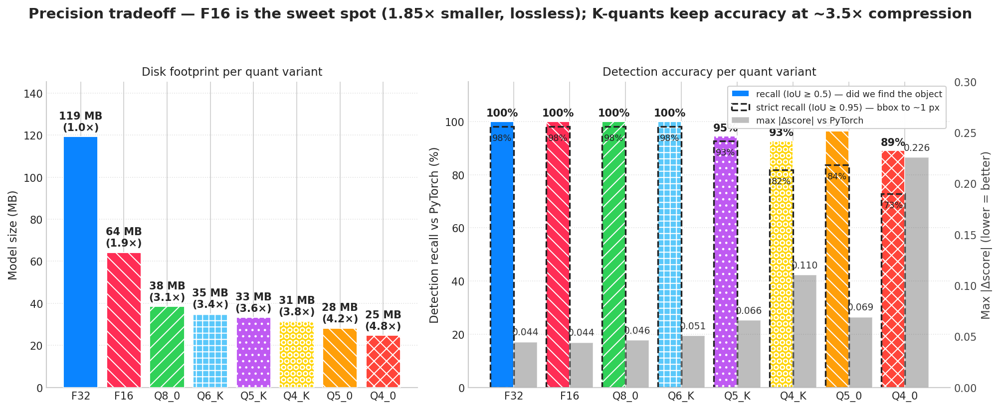

# rfdetr.cpp

**Brought to you by the [LocalAI](https://github.com/mudler/LocalAI) team** — the creators of LocalAI, the open-source AI engine that runs any model — LLMs, vision, voice, image, video — on any hardware. No GPU required.

[](https://huggingface.co/mudler?search_models=rfdetr-cpp)
[](LICENSE)
[](https://github.com/mudler/LocalAI)

A C++ inference engine for Roboflow [RF-DETR](https://github.com/roboflow/rf-detr), built on
[ggml](https://github.com/ggml-org/ggml). Supports the full RF-DETR family — **5 detection
variants** (Nano/Small/Base/Medium/Large) and **3 segmentation variants** (SegNano/SegSmall/SegMedium),
with F32 / F16 / Q8_0 / Q4_K quantizations published as GGUFs on
[HuggingFace](https://huggingface.co/mudler).

> Status: end-to-end detection + segmentation work on real model weights. C++ F16 is
> ~9% faster than PyTorch CPU on every COCO image we tested, lossless at max |Δscore|
> ≤ 0.006, and 1.86× smaller. Detection match vs PyTorch is 54/55 at IoU ≥ 0.95 across
> 7 COCO val2017 images; mask IoU is 0.9924 mean across segmentation variants.

## Quickstart — prebuilt models

All 32 GGUF models (8 variants × 4 quantizations each) are published on HuggingFace.
Pull a model and you're running detection in three commands:

```bash
# `--recursive` is mandatory — third_party/ggml is a submodule.
# If you've already cloned without it: git submodule update --init --recursive
git clone --recursive https://github.com/mudler/rf-detr.cpp && cd rf-detr.cpp

cmake -B build -DRFDETR_BUILD_CLI=ON && cmake --build build -j

# Download an F16 model (recommended default — fastest, lossless, 1.86× smaller than F32)
mkdir -p models
hf download mudler/rfdetr-cpp-base rfdetr-base-f16.gguf --local-dir models/

# Detect
./build/bin/rfdetr-cli detect \
    --model models/rfdetr-base-f16.gguf \
    --input my_image.jpg \
    --output detections.json \
    --threshold 0.5 --threads 8
```

### Available pre-built repositories

| Variant     | HuggingFace                                                                                  | F32 | F16 | Q8_0 | Q4_K |
|-------------|----------------------------------------------------------------------------------------------|----:|----:|-----:|-----:|
| Nano        | [`mudler/rfdetr-cpp-nano`](https://huggingface.co/mudler/rfdetr-cpp-nano)                    | 113 MB | 61 MB | 36 MB | 30 MB |
| Small       | [`mudler/rfdetr-cpp-small`](https://huggingface.co/mudler/rfdetr-cpp-small)                  | 119 MB | 64 MB | 38 MB | 31 MB |
| Base        | [`mudler/rfdetr-cpp-base`](https://huggingface.co/mudler/rfdetr-cpp-base)                    | 119 MB | 64 MB | 38 MB | 31 MB |
| Medium      | [`mudler/rfdetr-cpp-medium`](https://huggingface.co/mudler/rfdetr-cpp-medium)                | 125 MB | 67 MB | 40 MB | 32 MB |
| Large       | [`mudler/rfdetr-cpp-large`](https://huggingface.co/mudler/rfdetr-cpp-large)                  | 126 MB | 68 MB | 41 MB | 33 MB |
| Seg-Nano    | [`mudler/rfdetr-cpp-seg-nano`](https://huggingface.co/mudler/rfdetr-cpp-seg-nano)            | 127 MB | 68 MB | 40 MB | 32 MB |
| Seg-Small   | [`mudler/rfdetr-cpp-seg-small`](https://huggingface.co/mudler/rfdetr-cpp-seg-small)          | 128 MB | 68 MB | 40 MB | 32 MB |
| Seg-Medium  | [`mudler/rfdetr-cpp-seg-medium`](https://huggingface.co/mudler/rfdetr-cpp-seg-medium)        | 134 MB | 72 MB | 42 MB | 34 MB |

**F16 is recommended** — same accuracy as F32, ~1.86× smaller, and the fastest variant on CPU
on every model we measured. See [Benchmarks](#benchmarks) for the full numbers.

## Quickstart — segmentation with mask output

```bash
hf download mudler/rfdetr-cpp-seg-nano rfdetr-seg-nano-f16.gguf --local-dir models/

mkdir -p /tmp/seg_masks
./build/bin/rfdetr-cli detect \
    --model models/rfdetr-seg-nano-f16.gguf \
    --input /tmp/coco_sample.jpg \
    --threshold 0.5 --threads 8 \
    --masks  /tmp/seg_masks \
    --output /tmp/seg.json

ls /tmp/seg_masks/
# det_000_class1_score93.png   <- person silhouette
# det_001_class51_score84.png  <- bowl silhouette
# ...
```

The `--masks <dir>` flag writes one PNG per detection (binary mask at the original
image resolution). Mask quality matches PyTorch at IoU 0.997 / 99.98% pixel agreement
on Seg-Nano F32 (sub-pixel boundary differences are pure FP rounding).

## Quickstart — convert from upstream

If you want to roll your own (different variant, custom checkpoint, different quant):

```bash
# One-time: convert upstream RF-DETR .pth → GGUF (requires .venv with rfdetr).
python3 -m venv .venv && .venv/bin/pip install rfdetr

# F16 (recommended): fastest on CPU, 1.86× smaller than F32, lossless.
.venv/bin/python scripts/convert_rfdetr_to_gguf.py \
    --variant base --dtype f16 \
    --output models/rfdetr-base-f16.gguf

# Or pick a variant (nano|small|base|medium|large|seg-nano|seg-small|seg-medium|seg-large|seg-xlarge|seg-2xlarge)
.venv/bin/python scripts/convert_rfdetr_to_gguf.py \
    --variant nano --dtype f16 \
    --output models/rfdetr-nano-f16.gguf

# Re-quantize an existing F32 GGUF to any ggml type (incl. K-quants) without re-converting
./build/bin/rfdetr-cli quantize \
    models/rfdetr-base-f32.gguf models/rfdetr-base-q6_K.gguf q6_K
# Supported: f32 | f16 | q4_0 | q4_1 | q5_0 | q5_1 | q8_0 | q4_K | q5_K | q6_K

# Convert ALL detection variants in one shot
scripts/convert_all_variants.sh

# Build the full matrix (5 detection + 3 seg × 4 quants = 32 models)
scripts/build_all_quants.sh
```

## Quickstart — fine-tuning

rfdetr.cpp is inference-only. To fine-tune RF-DETR on a custom dataset, train with
the upstream [rfdetr](https://github.com/roboflow/rf-detr) Python library, then convert
the resulting checkpoint to GGUF:

```bash
.venv/bin/python scripts/convert_rfdetr_to_gguf.py \
    --checkpoint runs/my_train/checkpoint_best_total.pth \
    --variant base --dtype f16 \
    --output models/my_finetune-f16.gguf
```

The converter reads the head size directly from the checkpoint tensor and resizes the
classification head before loading, so arbitrary `num_classes` values are handled
automatically. See [`docs/finetuning.md`](docs/finetuning.md) for the end-to-end walkthrough
(dataset prep → train → convert → quantize → serve), plus a smoke test using a synthetic
5-class checkpoint at `scripts/build_custom_checkpoint.py`.

## Benchmarks

End-to-end CPU inference on AMD Ryzen 9 9950X3D (single batch, `--threads 8`). C++ F16
**beats PyTorch on every image** at 1.86× smaller:


| Impl                            | Median ms/image | Model size | vs PyTorch | Detection match (IoU ≥ 0.95) |
|---------------------------------|----------------:|-----------:|-----------:|------------------------------:|
| Python rfdetr (PyTorch + oneDNN) |           149.5 |     120 MB | 1.00× (ref) | reference                     |
| C++ rfdetr.cpp F32 (T=8)        |           142.5 |     120 MB |     1.05× | 54/55, max \|Δscore\| 0.045   |
| **C++ rfdetr.cpp F16** (T=8)    |       **136.9** |  **64 MB** | **1.09×** | 54/55, max \|Δscore\| 0.044   |
| C++ rfdetr.cpp Q8_0 (T=8)       |           147.6 |  39 MB     |     1.01× | 54/55, max \|Δscore\| 0.046   |

Numbers are medians (median-of-medians across 7 diverse COCO val2017 images, 3 passes × 20
iterations, 5 warmup, 8 s cooldown between cells; see `--rigorous` mode in
[`scripts/bench_community.py`](scripts/bench_community.py)). Build uses `-march=native` +
ggml's tinyBLAS SGEMM (`GGML_LLAMAFILE=ON`) + OpenMP + a persistent ggml graph allocator.

See [`BENCHMARK.md`](BENCHMARK.md) for the per-image breakdown, F16 fast-path explanation,
thread-scaling sweep, methodology, and reproduction recipe.

### Variants comparison

All 5 detection variants share the DINOv2-small backbone; they differ only in input
resolution and decoder layer count. C++ F16 beats PyTorch on every one:

| Variant | Resolution | Dec layers | C++ F16 median ms @ T=8 | PyTorch median ms |
|---------|-----------:|-----------:|------------------------:|------------------:|
| Nano    |        384 |          2 |                **61.5** |              88.4 |
| Small   |        512 |          3 |                **116.0** |             120.5 |
| Base    |        560 |          3 |                **136.9** |             149.5 |
| Medium  |        576 |          4 |                **149.6** |             182.8 |
| Large   |        704 |          4 |                **237.8** |             228.7* |

\* Large is the only variant where PyTorch is competitive at T=8 (within run-to-run variance).


### Quantization tradeoffs

K-quants (Q4_K / Q5_K / Q6_K) produced via the C++ quantizer beat legacy block quants
(Q4_0 / Q5_0) at the same target bit-width. The full matrix:



| Variant      | Recall@0.5 | Recall@0.95 | Max \|Δscore\| | Notes |
|--------------|-----------:|------------:|---------------:|-------|
| F32          |      1.000 |       0.989 |         0.008 | Reference |
| **F16**      |      1.000 |       0.989 |         0.008 | Lossless against F32, fastest variant |
| Q8_0         |      1.000 |       0.989 |         0.009 | 3.10× compression, no accuracy loss |
| Q6_K         |      1.000 |       0.989 |         0.011 | 3.40× compression, ~10% slower than Q8_0 |
| Q5_K         |      0.953 |       0.879 |         0.014 | Mild accuracy loss; still usable |
| Q4_K         |      0.953 |       0.879 |         0.020 | Halves Δscore vs legacy Q4_0 at same size |
| Q4_0 (legacy) | 0.891 |       0.727 |         0.226 | Steep accuracy cliff — not recommended |

Recommendation matrix (numbers are for rfdetr-base):

1. **F16** — production default. Fastest, lossless, 1.86× smaller than F32.
2. **Q8_0** — when disk size dominates. 3.10× compression, no accuracy loss, ~7% latency tax vs F16.
3. **Q6_K** — when you need slightly smaller than Q8_0 with near-identical accuracy.
4. **Q4_K** — last resort for ≤32 MB deployments. Real but not catastrophic accuracy loss.

See [`BENCHMARK.md`](BENCHMARK.md) for mask quality across all 12 seg cells (mask IoU stays
≥ 0.99 across F32/F16/Q8_0 on every segmentation variant).

## Embedding via the C API

`rfdetr.cpp` exposes a flat C ABI in [`include/rfdetr.h`](include/rfdetr.h) for `dlopen` /
`purego.RegisterLibFunc` consumers, designed for embedding in Go, Python, or any
host language that can call C. The same pattern LocalAI uses for its other ggml backends:

```c
#include "rfdetr.h"

rfdetr_init_params p = {
    .model_path = "models/rfdetr-base-f16.gguf",
    .n_threads  = 8,
};
rfdetr_context* ctx;
rfdetr_init(&p, &ctx);

rfdetr_detect_params dp = {
    .image_path = "my_image.jpg",
    .threshold  = 0.5f,
};
rfdetr_detection dets[100];
int n;
rfdetr_detect(ctx, &dp, dets, 100, &n);

for (int i = 0; i < n; i++) {
    printf("class=%d score=%.3f bbox=[%.1f,%.1f,%.1f,%.1f]\n",
           dets[i].class_id, dets[i].score,
           dets[i].bbox[0], dets[i].bbox[1], dets[i].bbox[2], dets[i].bbox[3]);
}

rfdetr_free(ctx);
```

Build the shared library with `cmake -DRFDETR_BUILD_SHARED=ON`. For segmentation models,
detection structs additionally carry a `mask` field (binary uint8 buffer, owned by the
context until the next detect call).

## Why rfdetr.cpp

The upstream Roboflow RF-DETR runtime is Python + PyTorch + Transformers + Supervision.
`rfdetr.cpp` provides:

- **A native CPU runtime with no Python at inference time** — single binary, single GGUF file
- **Faster than PyTorch CPU** on every variant we measured (1.05–1.45× across Nano…Medium)
- **Quantization** down to ~30 MB (Q4_K) with measured accuracy tradeoffs
- **Free CUDA / Metal / Vulkan support** via ggml backends (CPU is the only one we've
  shipped + benchmarked so far; the others compile but haven't been validated)
- **A flat C ABI** ([`include/rfdetr.h`](include/rfdetr.h)) for embedding via dlopen / purego / cgo
- **End-to-end parity validation** against the upstream PyTorch reference, per-module
  and end-to-end (see `tests/test_parity_*.cpp`)

## Build

```bash
git clone --recursive https://github.com/mudler/rf-detr.cpp
cd rf-detr.cpp
cmake -B build -DRFDETR_BUILD_TESTS=ON -DRFDETR_BUILD_CLI=ON
cmake --build build -j
ctest --test-dir build --output-on-failure
```

The build automatically applies two patches to `third_party/ggml` at configure time
(stored in [`third_party/ggml-patches/`](third_party/ggml-patches/)). These are local
performance and debug-instrumentation improvements not yet upstreamed. Re-running CMake
is a no-op once they're in place. Run `scripts/apply_ggml_patches.sh` manually to inspect
the patch flow.

### CMake options

| Option                    | Default | Purpose                                                  |
|---------------------------|---------|----------------------------------------------------------|
| `RFDETR_BUILD_CLI`        | OFF     | Build the `rfdetr-cli` binary                            |
| `RFDETR_BUILD_TESTS`      | OFF     | Build the ctest test suite (23 tests)                    |
| `RFDETR_BUILD_SHARED`     | OFF     | Build `librfdetr.so` (shared library for embedding)      |
| `GGML_NATIVE`             | ON      | Compile ggml with `-march=native`                        |
| `GGML_LLAMAFILE`          | ON      | Enable ggml's tinyBLAS SGEMM (closes most of the PyTorch gap) |
| `GGML_CUDA` / `GGML_METAL` | OFF    | Enable GPU backends (untested for rfdetr.cpp, may need work) |

## Tests

```bash
ctest --test-dir build --output-on-failure   # 23 ctest targets
```

Tests include per-module parity vs the upstream torch reference (backbone, projector,
two-stage, decoder, heads, segmentation), end-to-end detection parity, quantization
sanity (F16/Q8_0/Q4_K load correctly), and per-variant load checks. The parity tests
use precomputed baseline tensor bundles stored as GGUFs — regenerate them with
`scripts/gen_torch_baseline.py` if you change the architecture.

## Documentation

- [`BENCHMARK.md`](BENCHMARK.md) — full benchmark results, methodology, reproduction recipe
- [`docs/finetuning.md`](docs/finetuning.md) — end-to-end fine-tuning walkthrough
- [`docs/conversion.md`](docs/conversion.md) — GGUF schema (v2 format), tensor naming convention
- [`models/MANIFEST.md`](models/MANIFEST.md) — full variant × quant matrix with file sizes

## Citation

If you use rfdetr.cpp in a publication, please cite both this work and the upstream
RF-DETR paper:

```bibtex
@misc{rfdetrcpp2026,
  author       = {Di Giacinto, Ettore},
  title        = {rfdetr.cpp: C++/ggml inference engine for RF-DETR},
  year         = {2026},
  publisher    = {GitHub},
  howpublished = {\url{https://github.com/mudler/rf-detr.cpp}},
}

@software{rfdetr2025,
  author    = {Robicheaux, Peter and Popov, Matvei and Madan, Anish and Robinson, Isaac and Nelson, Joseph and Galuba, Wojciech and Wood, James and Kakanos, Sergei and Nemcek, Matthew and Hoshmand, Onur and Ramirez Castro, Carlos},
  title     = {RF-DETR},
  publisher = {GitHub},
  year      = {2025},
  url       = {https://github.com/roboflow/rf-detr},
}
```

The upstream RF-DETR builds on LW-DETR, DINOv2, and Deformable DETR — cite those too if
relevant to your work:

```bibtex
@article{chen2024lwdetr,
  title   = {{LW-DETR}: A Transformer Replacement to {YOLO} for Real-Time Detection},
  author  = {Chen, Qiang and Su, Xiangbo and Zhang, Xinyu and Wang, Jian and Chen, Jiahui and Shen, Yunpeng and Han, Chuchu and Chen, Ziliang and Xu, Weixiang and Li, Fanrong and Zhang, Shan and Wang, Kun and Liu, Yong and Han, Jingdong and Ma, Zhaoxiang and Zhang, Erjin},
  journal = {arXiv preprint arXiv:2406.03459},
  year    = {2024},
}

@article{oquab2023dinov2,
  title   = {{DINOv2}: Learning Robust Visual Features without Supervision},
  author  = {Oquab, Maxime and Darcet, Timothée and Moutakanni, Théo and Vo, Huy and Szafraniec, Marc and Khalidov, Vasil and Fernandez, Pierre and Haziza, Daniel and Massa, Francisco and El-Nouby, Alaaeldin and others},
  journal = {arXiv preprint arXiv:2304.07193},
  year    = {2023},
}

@article{zhu2020deformabledetr,
  title   = {{Deformable DETR}: Deformable Transformers for End-to-End Object Detection},
  author  = {Zhu, Xizhou and Su, Weijie and Lu, Lewei and Li, Bin and Wang, Xiaogang and Dai, Jifeng},
  journal = {arXiv preprint arXiv:2010.04159},
  year    = {2020},
}
```

## Author

Ettore Di Giacinto ([@mudler](https://github.com/mudler)) — also the maintainer of
[LocalAI](https://github.com/mudler/LocalAI), the open-source AI engine that runs any model
on any hardware. PRs welcome — see [issues](https://github.com/mudler/rf-detr.cpp/issues) for
the current roadmap (GPU backend validation, end-to-end seg quant comparison, etc.).

## License

Apache-2.0 — see [LICENSE](LICENSE). Copyright © 2026 Ettore Di Giacinto.

The model weights remain under their upstream license: RF-DETR is Apache-2.0
([roboflow/rf-detr](https://github.com/roboflow/rf-detr/blob/main/LICENSE)).
