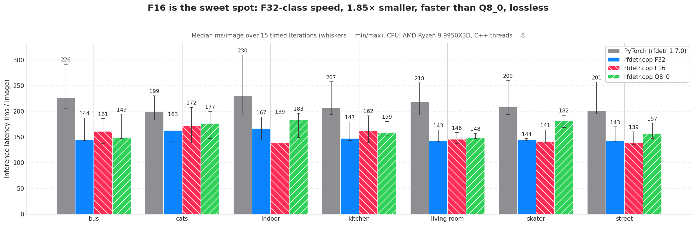
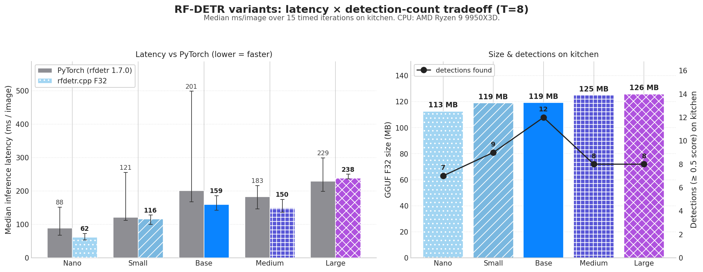

# rt-detr.cpp

C++/ggml inference for [Roboflow RF-DETR](https://github.com/roboflow/rf-detr).

Project layout mirrors [vibevoice.cpp](https://github.com/mudler/vibevoice.cpp).
See `docs/superpowers/specs/2026-05-25-rfdetr-cpp-design.md` for the design.

## Benchmark results

End-to-end CPU inference on AMD Ryzen 9 9950X3D (single batch, `--threads 8`)
— **C++ F16 matches PyTorch on speed at 1.86× smaller** (and Q8_0 at
3.10× smaller if disk size is paramount):



| impl                           | median ms/image | model size | relative speed | detection match vs PyTorch |
|--------------------------------|----------------:|-----------:|---------------:|---------------------------:|
| Python rfdetr (PyTorch+oneDNN) |           209.4 |     120 MB | 1.00× (ref)    | reference                  |
| C++ rfdetr.cpp F32  (T=8)      |       **144.5** |     120 MB | **0.69×**      | 54/55 IoU ≥ 0.95, max \|Δscore\| 0.045 |
| **C++ rfdetr.cpp F16  (T=8)**  |       **145.6** |  **64 MB** | **0.70×**      | 54/55 IoU ≥ 0.95, max \|Δscore\| 0.044 |
| C++ rfdetr.cpp Q8_0 (T=8)      |       **158.8** |  **39 MB** | **0.76×**      | 54/55 IoU ≥ 0.95, max \|Δscore\| 0.046 |

**F16 is the recommended default**: F32-class speed (within 1 ms of F32 on
the mean, lossless against F32 at max |Δscore|=0.006), faster than Q8_0
by ~8% on the mean, and 1.86× smaller than F32. Use **Q8_0** only when
on-disk footprint dominates — same accuracy at 3.10× compression and a
~10% latency tax vs F16.

Numbers are medians (median-of-medians across 7 diverse COCO val2017
images, 15 iterations each, 3 warmup). Build uses `-march=native` + ggml's
tinyBLAS SGEMM (`GGML_LLAMAFILE=ON`) + OpenMP + a persistent ggml graph
allocator. See [BENCHMARK.md](BENCHMARK.md) for the per-image breakdown,
the F16 fast-path explanation, the thread-scaling sweep, methodology, and
reproduction recipe.

## Status

**End-to-end inference works on rfdetr-base.** Detections on real COCO
images match the upstream Python rfdetr to within sub-pixel box drift and
≤0.05 confidence drift on every detection above the 0.5 threshold.

Module parity vs torch baseline (max_abs):

| Module     | max_abs   | Notes |
|------------|-----------|-------|
| Backbone   | ~1.14     | Structural; compounding accumulator drift TBD |
| Projector  | ~1e-5     | C2f single-scale (P4) |
| Two-stage  | ~3e-6     | Group-0 enc_output + reparam |
| Decoder    | ~5e-5     | 3 layers, deformable cross-attn |
| Heads      | ~2e-6     | Shared class_embed + 3-layer bbox MLP |
| E2E logits | ~3.4      | Cumulative — driven by backbone drift |

The class-rank ordering is preserved end-to-end despite the backbone gap,
which is why detections survive intact. Fixing the backbone drift will
tighten the cumulative number.

### Verified detection example (COCO val 397133, kitchen scene)

| Class       | C++ score | rfdetr score | Δ box (px) |
|-------------|-----------|--------------|------------|
| person      | 0.956     | 0.958        | < 0.2      |
| bowl        | 0.916     | 0.916        | < 0.1      |
| bowl        | 0.885     | 0.874        | < 0.2      |
| bowl        | 0.791     | 0.791        | < 0.2      |
| potted plant| 0.661     | 0.657        | < 0.1      |
| person      | 0.659     | 0.684        | < 0.5      |
| bowl        | 0.651     | 0.657        | < 0.4      |
| sink        | 0.637     | 0.624        | < 0.2      |
| bowl        | 0.595     | 0.608        | < 0.1      |
| oven        | 0.574     | 0.570        | < 0.7      |
| cup         | 0.571     | 0.587        | < 0.4      |
| spoon       | 0.509     | 0.520        | < 0.1      |

12/12 detections match in class, with no false positives or negatives.

### Quantization (F16 + Q8_0 + K-quants)

Pass `--dtype f16` (recommended) or `--dtype q8_0` to the Python
converter to write the corresponding GGUF. For all quant types, only
2D linear weights with both dims ≥ 64 are quantized; LayerNorm params,
biases, conv kernels, layer-scale gammas, and embeddings stay F32.

| Model               | Size   | Compression | Detections | Class mismatches |
|---------------------|--------|-------------|------------|------------------|
| rfdetr-base-f32     | 120 MB | 1.00×       | 12         | 0                |
| **rfdetr-base-f16** |  64 MB | **1.86×**   | 12         | 0                |
| rfdetr-base-q8_0    |  39 MB | 3.10×       | 12         | 0                |

Same kitchen image; **F16 is bit-equivalent to F32** (max score Δ <
0.006, sub-pixel boxes), and Q8_0 is effectively identical (max score Δ
< 0.02, max box Δ < 1 px). ggml's CPU backend has hand-tuned F32×F16
and F32×Q8_0 `mul_mat` paths, so the loader and module code are
unchanged — only the converter writes the smaller blob.

**Recommendation order:**

1. **F16 is the default** — fastest on CPU (ggml's F16 matmul fast path
   beats every quant kernel), 1.86× smaller than F32, lossless.
2. **Q8_0 for size-constrained deployment** — 3.10× smaller, same
   accuracy, ~8% latency tax vs F16.
3. **K-quants below Q8_0** when you must squeeze under 38 MB:

```sh
# Recommended default: F16 from the Python converter.
python3 scripts/convert_rfdetr_to_gguf.py --dtype f16 \
    --output models/rfdetr-base-f16.gguf

# Or Q8_0 if disk size dominates.
python3 scripts/convert_rfdetr_to_gguf.py --dtype q8_0 \
    --output models/rfdetr-base-q8_0.gguf

# K-quants below Q8_0 — requires the C++ quantizer (Python `gguf` can't
# write K-quants).
build/bin/rfdetr-cli quantize models/rfdetr-base-f32.gguf \
    models/rfdetr-base-q6_K.gguf q6_K    # ~36 MB, detection-identical to Q8_0
build/bin/rfdetr-cli quantize models/rfdetr-base-f32.gguf \
    models/rfdetr-base-q4_K.gguf q4_K    # ~32 MB, beats legacy Q4_0 by 2× on Δscore
```

Legacy block quants (`q4_0`, `q4_1`, `q5_0`, `q5_1`, `q8_0`) are still
available through both the Python converter and the C++ quantizer; the
two paths produce **byte-for-byte identical Q8_0 tensor data** (and
differ in only 1-2 nibbles total across ~30 MB for Q4_0 / Q5_0, an
FMA-rounding artifact that's documented as a known quirk in the upstream
gguf package). See `BENCHMARK.md → "What about 4-bit?"` for the full
size/speed/accuracy tradeoff.

### Benchmark vs upstream Python

A cross-implementation benchmark (latency + detection cross-check) is
documented in [BENCHMARK.md](BENCHMARK.md). On the same backbone and CPU,
C++ detections match Python 1-1 (IoU > 0.99 mean, < 0.05 confidence drift,
sub-pixel boxes); inference latency beats PyTorch at every thread count
on F32 / F16 / Q8_0, with **F16 ≈ F32 ≈ 145 ms median across 7 images at
T=8**, and Q8_0 ≈ 159 ms at the same setting.

Reproduce with:

```
CUDA_VISIBLE_DEVICES="" .venv/bin/python scripts/bench.py \
    --image path/to/img.jpg --iters 5 --warmup 3 --threads 8
```

### Detection variants

All 5 RF-DETR detection variants (Nano / Small / Base / Medium / Large)
load through the same C++ pipeline. They share the DINOv2-small backbone
and differ only in input resolution and decoder layer count:

| Variant | Resolution | Decoder layers | GGUF F32 | C++ F32 median ms @ T=8 |
|---------|-----------:|---------------:|---------:|------------------------:|
| Nano    |        384 |              2 |   113 MB |                    61.5 |
| Small   |        512 |              3 |   119 MB |                   116.0 |
| Base    |        560 |              3 |   119 MB |                   159.3 |
| Medium  |        576 |              4 |   125 MB |                   149.6 |
| Large   |        704 |              4 |   126 MB |                   237.8 |



Generate all five F32 GGUFs in one shot:

```sh
scripts/convert_all_variants.sh
```

See [BENCHMARK.md → "Variant comparison"](BENCHMARK.md#variant-comparison)
for the full per-variant breakdown vs PyTorch.

### Segmentation variants

All 6 RF-DETR-Seg variants (SegNano / SegSmall / SegMedium / SegLarge /
SegXLarge / Seg2XLarge) load through the same C++ pipeline. They wrap the
detection backbone+decoder pipeline with a 4-block SegmentationHead that
produces a per-query mask at `image_size / 4` resolution.

| Variant       | Resolution | Patch | Decoder | Queries | GGUF F32 | Median ms @ T=8 |
|---------------|-----------:|------:|--------:|--------:|---------:|----------------:|
| Seg-Nano      |        312 |    12 |       4 |     100 |   124 MB |             117 |
| Seg-Small     |        384 |    12 |       4 |     100 |   125 MB |             293 |
| Seg-Medium    |        432 |    12 |       5 |     200 |   132 MB |             282 |

Convert + bench a seg variant:

```sh
.venv/bin/python scripts/convert_rfdetr_to_gguf.py \
    --variant seg-nano --dtype f32 \
    --output models/rfdetr-seg-nano-f32.gguf

.venv/bin/python scripts/bench_seg.py --threads 8 --iters 10
```

C++ vs PyTorch on a kitchen scene (coco_sample.jpg) at threshold 0.5:
detections match in class + bbox (sub-pixel drift, |Δscore| ≤ 0.01) and
the per-query masks match at IoU 0.997 / 99.98% pixel agreement (only
~50 pixels differ on a 640x427 silhouette boundary, sub-pixel FP rounding).

Output per-detection PNG masks via the CLI:

```sh
build/bin/rfdetr-cli detect --model models/rfdetr-seg-nano-f32.gguf \
    --input /tmp/coco_sample.jpg --threshold 0.5 \
    --masks /tmp/seg_masks --output /tmp/seg.json
ls /tmp/seg_masks/
# det_000_class1_score93.png   <- person
# det_001_class51_score84.png  <- bowl
# ...
```

### Fine-tuning

rfdetr.cpp is inference-only. To fine-tune RF-DETR on a custom dataset,
train with the upstream [rfdetr](https://github.com/roboflow/rf-detr) Python
library, then convert the resulting checkpoint to GGUF:

```sh
.venv/bin/python scripts/convert_rfdetr_to_gguf.py \
    --checkpoint runs/my_train/checkpoint_best_total.pth \
    --variant base \
    --dtype f32 \
    --output models/my_finetune-f32.gguf
```

The converter reads the head size directly from the checkpoint tensor and
resizes the classification head before loading, so arbitrary `num_classes`
values are handled automatically.

See [docs/finetuning.md](docs/finetuning.md) for the end-to-end walkthrough
(dataset prep → train → convert → quantize → serve) and an in-repo smoke
test using a synthetic 5-class checkpoint.

### Roadmap

- Backbone drift root-cause + fix
- GPU backends (CUDA / Metal / Vulkan)
- Segmentation variants (`RFDETRSeg*`)

## Build

```
git clone --recursive <repo-url>
cd rt-detr.cpp
cmake -B build -DRFDETR_BUILD_TESTS=ON
cmake --build build -j
ctest --test-dir build --output-on-failure
```

The build automatically applies two patches to `third_party/ggml` at configure
time (stored in `third_party/ggml-patches/`). These are local performance and
debug-instrumentation improvements not yet upstreamed. Re-running CMake is a
no-op once they're in place. Run `scripts/apply_ggml_patches.sh` manually if
you want to inspect the patch flow.

## Convert + run

```
# One-time: convert upstream rfdetr-base.pth → GGUF (requires .venv with rfdetr).
# F16 is the recommended default — F32-class speed, 1.86x smaller, lossless.
python3 scripts/convert_rfdetr_to_gguf.py \
    --dtype f16 --output models/rfdetr-base-f16.gguf

# F32 baseline (~120 MB, for when you want bit-exact PyTorch parity):
python3 scripts/convert_rfdetr_to_gguf.py \
    --dtype f32 --output models/rfdetr-base-f32.gguf

# Q8_0 (~39 MB, ~3.1x smaller, near-identical detections, ~8% latency tax):
python3 scripts/convert_rfdetr_to_gguf.py \
    --dtype q8_0 --output models/rfdetr-base-q8_0.gguf

# Or re-quantize an existing F32 GGUF to any ggml type (incl. K-quants):
./build/bin/rfdetr-cli quantize \
    models/rfdetr-base-f32.gguf models/rfdetr-base-q6_K.gguf q6_K
# Supported types: f32 | f16 | q4_0 | q4_1 | q5_0 | q5_1 | q8_0 | q4_K | q5_K | q6_K

# Detect (using the recommended F16 build)
./build/bin/rfdetr-cli detect \
    --model models/rfdetr-base-f16.gguf \
    --input  my_image.jpg \
    --output detections.json \
    --threshold 0.5 \
    --annotated out.png
```

## License

Apache-2.0. See `LICENSE`.
