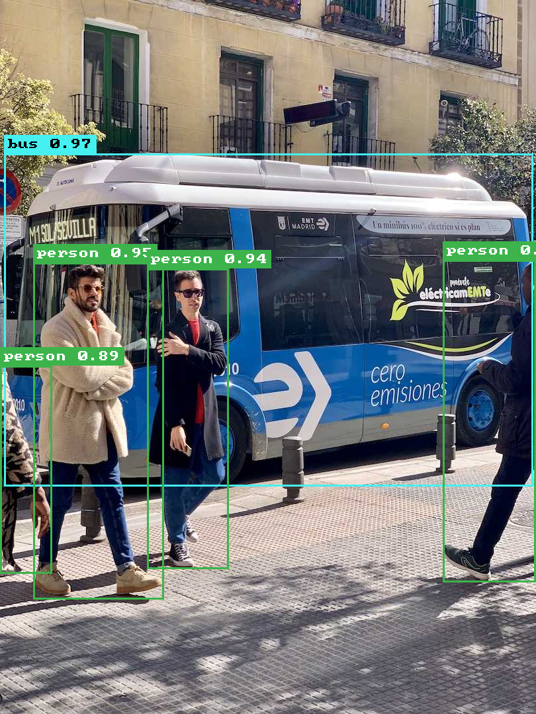
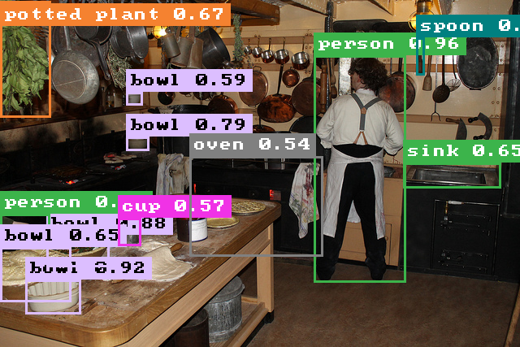
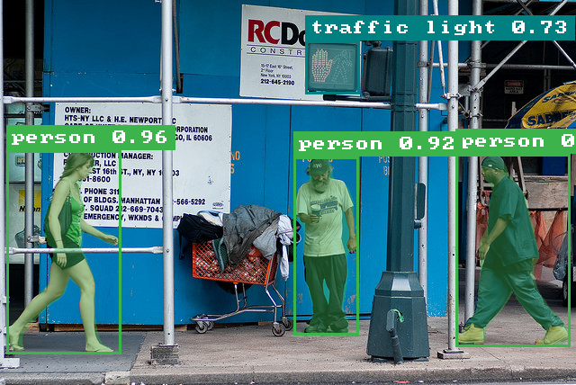
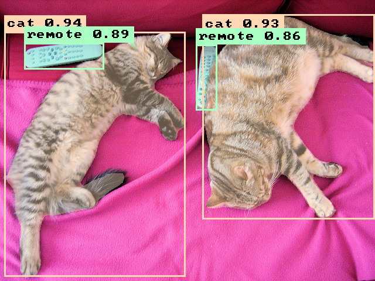

# rf-detr.cpp

**Brought to you by the [LocalAI](https://github.com/mudler/LocalAI) team**, the creators of LocalAI: the open-source AI engine that runs any model (LLMs, vision, voice, image, video) on any hardware. No GPU required.

[](https://huggingface.co/mudler?search_models=rfdetr-cpp)
[](LICENSE)
[](https://github.com/mudler/LocalAI)

A C++ inference engine for Roboflow [RF-DETR](https://github.com/roboflow/rf-detr), built on
[ggml](https://github.com/ggml-org/ggml). Supports 5 RF-DETR detection variants
(Nano/Small/Base/Medium/Large) and 6 segmentation variants
(SegNano/SegSmall/SegMedium/SegLarge/SegXLarge/Seg2XLarge), with F32 / F16 / Q8_0 /
Q4_K quantizations published as GGUFs on [HuggingFace](https://huggingface.co/mudler).
The keypoint-preview head is not yet supported.

> Status: end-to-end detection and segmentation work on real model weights. C++ F16 is
> about 9% faster than PyTorch CPU on every COCO image we tested, matches F32 accuracy
> (max |Δscore| ≤ 0.006), and is 1.86x smaller. Detection match vs PyTorch is 54/55 at
> IoU ≥ 0.95 across 7 COCO val2017 images. Mask IoU is 0.9924 mean across segmentation
> variants.
>
> **RF-DETR 1.9:** all 11 variants (44 GGUFs) are converted, verified, and parity-swept
> against `rfdetr==1.9.0` — see [RF-DETR 1.9 parity](#rf-detr-19-parity)
> for the full per-variant, per-quant table. New GGUFs record the antialias-free bilinear
> preprocessing introduced upstream, while GGUFs without that metadata retain the prior
> resize path for output compatibility.

## Examples

Detection (rfdetr-base, F16):

| Bus + pedestrians | Kitchen scene |
|---|---|
|  |  |

Segmentation (rfdetr-seg-nano, F16) with per-class mask overlay:

| Street scene | Cats + remotes |
|---|---|
|  |  |

All outputs above were produced by `rfdetr-cli detect --annotated <path>.png`; the
renderer draws per-class colored boxes with class name + score labels, and for
segmentation models overlays the per-detection mask in the same class color.

## Quickstart: prebuilt models

All 44 GGUF models (11 variants x 4 quantizations) are published on HuggingFace. Pull one
and run detection in three commands:

```bash
# `--recursive` is mandatory: third_party/ggml is a submodule.
# If you've already cloned without it: git submodule update --init --recursive
git clone --recursive https://github.com/mudler/rf-detr.cpp && cd rf-detr.cpp

cmake -B build -DRFDETR_BUILD_CLI=ON && cmake --build build -j

# F16 is the default we recommend: fastest on CPU, matches F32 accuracy, 1.86x smaller.
mkdir -p models
hf download mudler/rfdetr-cpp-base rfdetr-base-f16.gguf --local-dir models/

# Detect
./build/bin/rfdetr-cli detect \
    --model models/rfdetr-base-f16.gguf \
    --input my_image.jpg \
    --output detections.json \
    --threshold 0.5 --threads 8
```

### Available pre-built repositories

| Variant     | HuggingFace                                                                                  | F32 | F16 | Q8_0 | Q4_K |
|-------------|----------------------------------------------------------------------------------------------|----:|----:|-----:|-----:|
| Nano        | [`mudler/rfdetr-cpp-nano`](https://huggingface.co/mudler/rfdetr-cpp-nano)                    | 113 MB | 61 MB | 36 MB | 30 MB |
| Small       | [`mudler/rfdetr-cpp-small`](https://huggingface.co/mudler/rfdetr-cpp-small)                  | 119 MB | 64 MB | 38 MB | 31 MB |
| Base        | [`mudler/rfdetr-cpp-base`](https://huggingface.co/mudler/rfdetr-cpp-base)                    | 119 MB | 64 MB | 38 MB | 31 MB |
| Medium      | [`mudler/rfdetr-cpp-medium`](https://huggingface.co/mudler/rfdetr-cpp-medium)                | 125 MB | 67 MB | 40 MB | 32 MB |
| Large       | [`mudler/rfdetr-cpp-large`](https://huggingface.co/mudler/rfdetr-cpp-large)                  | 126 MB | 68 MB | 41 MB | 33 MB |
| Seg-Nano    | [`mudler/rfdetr-cpp-seg-nano`](https://huggingface.co/mudler/rfdetr-cpp-seg-nano)            | 127 MB | 68 MB | 40 MB | 32 MB |
| Seg-Small   | [`mudler/rfdetr-cpp-seg-small`](https://huggingface.co/mudler/rfdetr-cpp-seg-small)          | 128 MB | 68 MB | 40 MB | 32 MB |
| Seg-Medium  | [`mudler/rfdetr-cpp-seg-medium`](https://huggingface.co/mudler/rfdetr-cpp-seg-medium)        | 134 MB | 72 MB | 42 MB | 34 MB |
| Seg-Large   | [`mudler/rfdetr-cpp-seg-large`](https://huggingface.co/mudler/rfdetr-cpp-seg-large)          | 134 MB | 72 MB | 43 MB | 34 MB |
| Seg-XLarge  | [`mudler/rfdetr-cpp-seg-xlarge`](https://huggingface.co/mudler/rfdetr-cpp-seg-xlarge)        | 141 MB | 76 MB | 45 MB | 36 MB |
| Seg-2XLarge | [`mudler/rfdetr-cpp-seg-2xlarge`](https://huggingface.co/mudler/rfdetr-cpp-seg-2xlarge)      | 143 MB | 78 MB | 48 MB | 38 MB |

Use F16 by default. It matches F32 accuracy, is 1.86x smaller, and is the fastest variant
on CPU on every model we measured. See [Benchmarks](#benchmarks) for the full numbers.

## Quickstart: segmentation with mask output

```bash
hf download mudler/rfdetr-cpp-seg-nano rfdetr-seg-nano-f16.gguf --local-dir models/

mkdir -p /tmp/seg_masks
./build/bin/rfdetr-cli detect \
    --model models/rfdetr-seg-nano-f16.gguf \
    --input /tmp/coco_sample.jpg \
    --threshold 0.5 --threads 8 \
    --masks  /tmp/seg_masks \
    --output /tmp/seg.json

ls /tmp/seg_masks/
# det_000_class1_score93.png   <- person silhouette
# det_001_class51_score84.png  <- bowl silhouette
# ...
```

The `--masks <dir>` flag writes one PNG per detection (binary mask at the original
image resolution). Mask quality matches PyTorch at IoU 0.997 and 99.98% pixel agreement
on Seg-Nano F32; the remaining differences are sub-pixel boundary FP rounding.

## Quickstart: convert from upstream

To roll your own (different variant, custom checkpoint, different quant):

```bash
# One-time: install the pinned, conversion-tested RF-DETR toolchain.
python3 -m venv .venv
.venv/bin/pip install -r scripts/requirements.txt

# F16: fastest on CPU, 1.86x smaller than F32, matches F32 accuracy.
.venv/bin/python scripts/convert_rfdetr_to_gguf.py \
    --variant base --dtype f16 \
    --output models/rfdetr-base-f16.gguf

# Pick a variant (nano|small|base|medium|large|seg-nano|seg-small|seg-medium|seg-large|seg-xlarge|seg-2xlarge)
.venv/bin/python scripts/convert_rfdetr_to_gguf.py \
    --variant nano --dtype f16 \
    --output models/rfdetr-nano-f16.gguf

# Re-quantize an existing F32 GGUF to any ggml type (incl. K-quants) without re-converting
./build/bin/rfdetr-cli quantize \
    models/rfdetr-base-f32.gguf models/rfdetr-base-q6_K.gguf q6_K
# Supported: f32 | f16 | q4_0 | q4_1 | q5_0 | q5_1 | q8_0 | q4_K | q5_K | q6_K

# Convert all detection variants in one shot
scripts/convert_all_variants.sh

# Build the full matrix (5 detection + 6 seg, 4 quants each, = 44 models)
scripts/build_all_quants.sh
```

## Quickstart: fine-tuning

rf-detr.cpp is inference-only. To fine-tune RF-DETR on a custom dataset, train with the
upstream [rfdetr](https://github.com/roboflow/rf-detr) Python library, then convert the
resulting checkpoint to GGUF:

```bash
.venv/bin/python scripts/convert_rfdetr_to_gguf.py \
    --checkpoint runs/my_train/checkpoint_best_total.pth \
    --variant base --dtype f16 \
    --output models/my_finetune-f16.gguf
```

The converter reads the head size directly from the checkpoint tensor and resizes the
classification head before loading, so arbitrary `num_classes` values are handled
automatically. Checkpoints use RF-DETR 1.9's restricted loader by default; pass
`--trust-checkpoint` only for a legacy checkpoint whose source you fully trust. See
[`docs/finetuning.md`](docs/finetuning.md) for the end-to-end walkthrough
(dataset prep, train, convert, quantize, serve), plus a smoke test using a synthetic 5-class
checkpoint at `scripts/build_custom_checkpoint.py`.

## Benchmarks

The latency/quantization tables below (AMD Ryzen 9 9950X3D, `rfdetr-base`, 7 COCO val2017
images) predate the RF-DETR 1.9 upgrade — the detection/segmentation architectures
themselves are unchanged, so latency and relative quant behavior still apply, but they were
measured against `rfdetr` checkpoints converted with the pre-1.9 converter. See
[**RF-DETR 1.9 parity**](#rf-detr-19-parity) below for the accuracy
numbers actually measured against `rfdetr==1.9.0` on the current 44-model matrix.

End-to-end CPU inference on AMD Ryzen 9 9950X3D (single batch, `--threads 8`). C++ F16 is
faster than PyTorch on every image, at 1.86x smaller:


| Impl                            | Median ms/image | Model size | vs PyTorch | Detection match (IoU ≥ 0.95) |
|---------------------------------|----------------:|-----------:|-----------:|------------------------------:|
| Python rfdetr (PyTorch + oneDNN) |           149.5 |     120 MB | 1.00x (ref) | reference                     |
| C++ rf-detr.cpp F32 (T=8)        |           142.5 |     120 MB |     1.05x | 54/55, max \|Δscore\| 0.045   |
| **C++ rf-detr.cpp F16** (T=8)    |       **136.9** |  **64 MB** | **1.09x** | 54/55, max \|Δscore\| 0.044   |
| C++ rf-detr.cpp Q8_0 (T=8)       |           147.6 |  39 MB     |     1.01x | 54/55, max \|Δscore\| 0.046   |

Numbers are medians (median-of-medians across 7 diverse COCO val2017 images, 3 passes of 20
iterations each, 5 warmup, 8 s cooldown between cells; see `--rigorous` mode in
[`scripts/bench_community.py`](scripts/bench_community.py)). Build uses `-march=native` plus
ggml's tinyBLAS SGEMM (`GGML_LLAMAFILE=ON`) plus OpenMP plus a persistent ggml graph
allocator.

See [`BENCHMARK.md`](BENCHMARK.md) for the per-image breakdown, F16 fast-path explanation,
thread-scaling sweep, methodology, and reproduction recipe.

### RF-DETR 1.9 parity

PyTorch-vs-C++ parity is swept across every (variant × quant) cell of the current 44-model
matrix, using the same 7-image methodology (and the same 1.7.0 baseline) as the tables
above. F32/F16/Q8_0 hold up or improve across the board; Q4_K remains real, variant-dependent
lossy accuracy (worst case Recall@0.95 = 0.394 on Seg-Small) — consistent with the 1.7.0
Q4_K findings on the same variant.

See [**BENCHMARK.md § Accuracy across the full model matrix (rfdetr 1.9.0)**](BENCHMARK.md#accuracy-across-the-full-model-matrix-rfdetr-190)
for the full per-variant, per-quant table (and its 1.7.0 predecessor, and a takeaways
section comparing the two). Raw data:
[`benchmarks/results/accuracy_sweep.json`](benchmarks/results/accuracy_sweep.json).

## Embedding via the C API

rf-detr.cpp exposes a flat C ABI in [`include/rfdetr.h`](include/rfdetr.h) for `dlopen` and
`purego.RegisterLibFunc` consumers, intended for embedding in Go, Python, or any host
language that can call C. It follows the same pattern LocalAI uses for its other ggml
backends:

```c
#include "rfdetr.h"

rfdetr_init_params p = {
    .model_path = "models/rfdetr-base-f16.gguf",
    .n_threads  = 8,
};
rfdetr_context* ctx;
rfdetr_init(&p, &ctx);

rfdetr_detect_params dp = {
    .image_path = "my_image.jpg",
    .threshold  = 0.5f,
};
rfdetr_detection dets[100];
int n;
rfdetr_detect(ctx, &dp, dets, 100, &n);

for (int i = 0; i < n; i++) {
    printf("class=%d score=%.3f bbox=[%.1f,%.1f,%.1f,%.1f]\n",
           dets[i].class_id, dets[i].score,
           dets[i].bbox[0], dets[i].bbox[1], dets[i].bbox[2], dets[i].bbox[3]);
}

rfdetr_free(ctx);
```

Build the shared library with `cmake -DRFDETR_SHARED=ON`. For segmentation models,
detection structs additionally carry a `mask` field (binary uint8 buffer, owned by the
context until the next detect call).

## Why rf-detr.cpp

The upstream Roboflow RF-DETR runtime is Python + PyTorch + Transformers + Supervision.
rf-detr.cpp provides:

- A native CPU runtime with no Python at inference time. The CLI is a single binary that
  takes a GGUF file and an image.
- Faster than PyTorch CPU on every variant we measured (1.05x to 1.45x across
  Nano-to-Medium).
- Quantization down to about 30 MB (Q4_K) with measured accuracy tradeoffs.
- GPU offload via ggml backends (CUDA / Metal / Vulkan / HIP). Build with
  `-DRFDETR_GGML_CUDA=ON` (or `_METAL` / `_VULKAN` / `_HIPBLAS`) and inference
  runs on the GPU: weights are realized in VRAM and the compute graph runs on
  the device, with the deformable-attention sampler automatically falling back
  to CPU via the ggml scheduler. Validated on an NVIDIA GB10: 23.6 ms/image
  (F16) vs 274 ms on the same box's CPU — an 11.6x speedup.
- A flat C ABI ([`include/rfdetr.h`](include/rfdetr.h)) for embedding via dlopen, purego,
  or cgo.
- End-to-end parity validation against the upstream PyTorch reference, per-module and
  end-to-end (see `tests/test_parity_*.cpp`).

## Build

```bash
git clone --recursive https://github.com/mudler/rf-detr.cpp
cd rf-detr.cpp
cmake -B build -DRFDETR_BUILD_TESTS=ON -DRFDETR_BUILD_CLI=ON
cmake --build build -j
ctest --test-dir build --output-on-failure
```

The build applies two patches to `third_party/ggml` at configure time (stored in
[`third_party/ggml-patches/`](third_party/ggml-patches/)). These are local performance and
debug-instrumentation improvements not yet upstreamed. Re-running CMake is a no-op once
they're in place. Run `scripts/apply_ggml_patches.sh` manually to inspect the patch flow.

### CMake options

| Option                    | Default | Purpose                                                  |
|---------------------------|---------|----------------------------------------------------------|
| `RFDETR_BUILD_CLI`        | ON      | Build the `rfdetr-cli` binary                            |
| `RFDETR_BUILD_TESTS`      | OFF     | Build the ctest test suite (24 tests)                    |
| `RFDETR_SHARED`           | OFF     | Build `librfdetr.so` (shared library for embedding)      |
| `GGML_NATIVE`             | ON      | Compile ggml with `-march=native`                        |
| `GGML_LLAMAFILE`          | ON      | Enable ggml's tinyBLAS SGEMM (closes most of the PyTorch gap) |
| `RFDETR_GGML_CUDA` / `_METAL` / `_VULKAN` / `_HIPBLAS` | OFF | Offload inference to GPU. Weights go to VRAM; the deformable-attention sampler falls back to CPU via the ggml scheduler. One backend per build. |

### GPU offload

rf-detr.cpp can offload inference to a GPU via ggml's backends. Build with one
of:

```bash
cmake -B build -DRFDETR_BUILD_CLI=ON -DRFDETR_GGML_CUDA=ON     # NVIDIA (CUDA)
cmake -B build -DRFDETR_BUILD_CLI=ON -DRFDETR_GGML_HIPBLAS=ON  # AMD (ROCm/HIP)
cmake -B build -DRFDETR_BUILD_CLI=ON -DRFDETR_GGML_METAL=ON    # Apple (Metal)
cmake -B build -DRFDETR_BUILD_CLI=ON -DRFDETR_GGML_VULKAN=ON   # cross-vendor (Vulkan)
```

When a device is present, model weights are realized in VRAM and the compute
graph runs on the GPU. The one op without a GPU kernel — the deformable-
attention bilinear sampler — is automatically run on CPU by the ggml
scheduler, which inserts the device↔host copies. If no device is found at
runtime, it falls back cleanly to CPU.

Validated on an NVIDIA GB10 (Grace Blackwell, CUDA 13, compute capability
12.1): rfdetr-base F16 runs at **23.6 ms/image** on the GPU vs **274 ms** on
the same box's 20-core ARM CPU (8 threads) — an **11.6x speedup**. Detections
match the CPU baseline within the standard tolerance (score ≤ 0.05, bbox
≤ 2 px); the 3 deformable-attention ops are confirmed running on CPU via the
scheduler. See [BENCHMARK.md](BENCHMARK.md#gpu) for details.

## Tests

```bash
ctest --test-dir build --output-on-failure   # 24 ctest targets
```

Tests cover per-module parity vs the upstream torch reference (backbone, projector,
two-stage, decoder, heads, segmentation), end-to-end detection parity, quantization
sanity (F16/Q8_0/Q4_K load correctly), and per-variant load checks. The parity tests
use precomputed baseline tensor bundles stored as GGUFs; regenerate them with
`scripts/gen_torch_baseline.py` if you change the architecture.

## Documentation

- [`BENCHMARK.md`](BENCHMARK.md): full benchmark results, methodology, reproduction recipe
- [`docs/finetuning.md`](docs/finetuning.md): end-to-end fine-tuning walkthrough
- [`docs/conversion.md`](docs/conversion.md): GGUF schema (v2 format), tensor naming
- [`models/MANIFEST.md`](models/MANIFEST.md): full variant x quant matrix with file sizes
- [`AGENTS.md`](AGENTS.md): maintenance reference for humans and agents

## Citation

If you use rf-detr.cpp in a publication, please cite both this work and the upstream
RF-DETR paper:

```bibtex
@misc{rfdetrcpp2026,
  author       = {Di Giacinto, Ettore and Palethorpe, Richard},
  title        = {rf-detr.cpp: C++/ggml inference engine for RF-DETR},
  year         = {2026},
  publisher    = {GitHub},
  howpublished = {\url{https://github.com/mudler/rf-detr.cpp}},
}

@software{rfdetr2025,
  author    = {Robicheaux, Peter and Popov, Matvei and Madan, Anish and Robinson, Isaac and Nelson, Joseph and Galuba, Wojciech and Wood, James and Kakanos, Sergei and Nemcek, Matthew and Hoshmand, Onur and Ramirez Castro, Carlos},
  title     = {RF-DETR},
  publisher = {GitHub},
  year      = {2025},
  url       = {https://github.com/roboflow/rf-detr},
}
```

The upstream RF-DETR builds on LW-DETR, DINOv2, and Deformable DETR; cite those too if
relevant to your work:

```bibtex
@article{chen2024lwdetr,
  title   = {{LW-DETR}: A Transformer Replacement to {YOLO} for Real-Time Detection},
  author  = {Chen, Qiang and Su, Xiangbo and Zhang, Xinyu and Wang, Jian and Chen, Jiahui and Shen, Yunpeng and Han, Chuchu and Chen, Ziliang and Xu, Weixiang and Li, Fanrong and Zhang, Shan and Wang, Kun and Liu, Yong and Han, Jingdong and Ma, Zhaoxiang and Zhang, Erjin},
  journal = {arXiv preprint arXiv:2406.03459},
  year    = {2024},
}

@article{oquab2023dinov2,
  title   = {{DINOv2}: Learning Robust Visual Features without Supervision},
  author  = {Oquab, Maxime and Darcet, Timothée and Moutakanni, Théo and Vo, Huy and Szafraniec, Marc and Khalidov, Vasil and Fernandez, Pierre and Haziza, Daniel and Massa, Francisco and El-Nouby, Alaaeldin and others},
  journal = {arXiv preprint arXiv:2304.07193},
  year    = {2023},
}

@article{zhu2020deformabledetr,
  title   = {{Deformable DETR}: Deformable Transformers for End-to-End Object Detection},
  author  = {Zhu, Xizhou and Su, Weijie and Lu, Lewei and Li, Bin and Wang, Xiaogang and Dai, Jifeng},
  journal = {arXiv preprint arXiv:2010.04159},
  year    = {2020},
}
```

## Author

Ettore Di Giacinto ([@mudler](https://github.com/mudler)), maintainer of
[LocalAI](https://github.com/mudler/LocalAI). PRs welcome; see
[issues](https://github.com/mudler/rf-detr.cpp/issues) for the current roadmap (GPU
backend validation, end-to-end seg quant comparison, etc.).

## License

Apache-2.0; see [LICENSE](LICENSE). Copyright © 2026 Ettore Di Giacinto.

The model weights remain under their upstream license: RF-DETR is Apache-2.0
([roboflow/rf-detr](https://github.com/roboflow/rf-detr/blob/main/LICENSE)).
